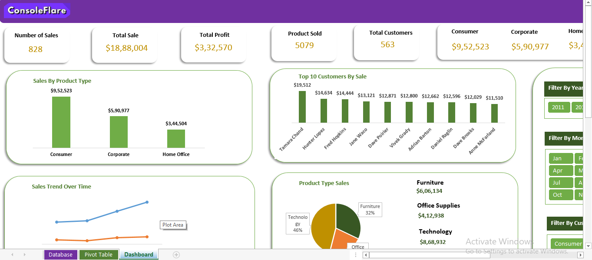

# 📊 Excel Sales Performance Dashboard

## 📌 Project Overview
An interactive **Sales Performance Dashboard built in Microsoft Excel** to analyze sales, profit, customers, products, shipping costs, and order trends.
The dashboard uses **PivotTables, PivotCharts, Slicers, formulas, and interactive filters** to convert raw sales data into meaningful business insights.

## 🎯 Business Objective
The objective of this project is to provide management with an easy-to-use dashboard for monitoring:
- Overall sales performance
- Profitability
- Customer performance
- Product/category performance
- Sales trends over time
- Shipping costs and losses
- Customer and product segments
- Geographic sales performance

## 🛠️ Tools & Techniques Used
- Microsoft Excel
- PivotTables
- PivotCharts
- Slicers
- Excel formulas
- Data aggregation
- Data filtering
- Dashboard design
- KPI reporting
- Interactive data visualization

## 📊 Key KPIs
The dashboard tracks the following key performance indicators:

| KPI | Purpose |
| Total Sales | Measures overall revenue generated |
| Total Profit | Measures overall profitability |
| Product Sold | Tracks total quantity of products sold |
| Total Customers | Measures customer base |
| Shipping Cost | Tracks logistics/shipping expenses |
| Loss | Identifies negative profitability |
| Sales by Customer Type | Compares Consumer, Corporate & Home Office |
| Sales by Product Type | Compares Furniture, Office Supplies & Technology |
| Top 10 Customers | Identifies highest-value customers |
| Sales Trend | Tracks sales performance over time |
| Orders by Month | Analyzes monthly order volume |
| Sales by Country | Identifies geographic sales performance |

## 📈 Dashboard Features
### 🔹 KPI Summary
Provides a high-level view of:
- Total Sales
- Total Profit
- Product Sold
- Total Customers
- Shipping Cost
- Loss
### 🔹 Customer Analysis
Analyzes:
- Top 10 customers by sales
- Sales by customer type
- Consumer
- Corporate
- Home Office
### 🔹 Product Analysis
Analyzes:
- Sales by product type
- Sales by individual products
- Furniture
- Office Supplies
- Technology
### 🔹 Time-Based Analysis
Interactive filtering and analysis by:
- Year
- Month
- Quarter
- Order Date
### 🔹 Geographic Analysis
Sales performance can be analyzed by country using interactive filters.

## 🎛️ Interactive Filters
The dashboard includes interactive slicers for:
- Year
- Month
- Customer Type
- Product Type
- Country
These filters allow users to dynamically analyze different segments of the business.

## 📷 Dashboard Screenshots

## 💡 Key Business Insights
The dashboard enables users to identify:
- High-performing customer segments
- Top revenue-generating customers
- Best-performing product categories
- Monthly sales and order trends
- Geographic sales opportunities
- Shipping cost impact
- Areas generating losses
- Changes in sales performance over time

## 📁 Project Files

- `amazon.xlsx` – Excel dashboard and analysis
- `Dashboard1.png`
- `Dashboard2.png`
- `Dashboard3.png`
- `Dashboard4.png`
